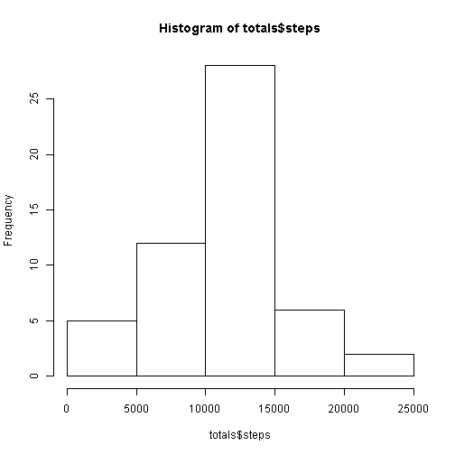
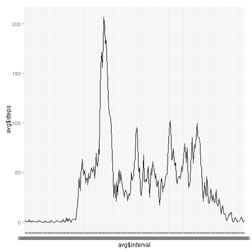
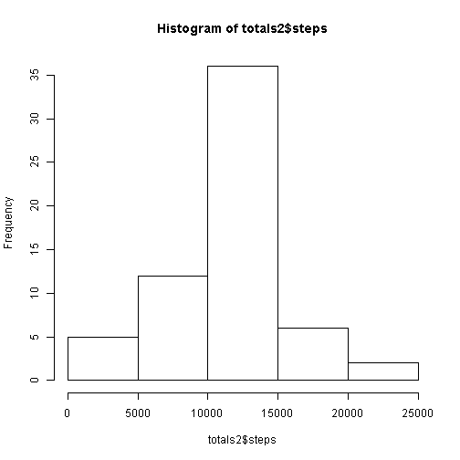
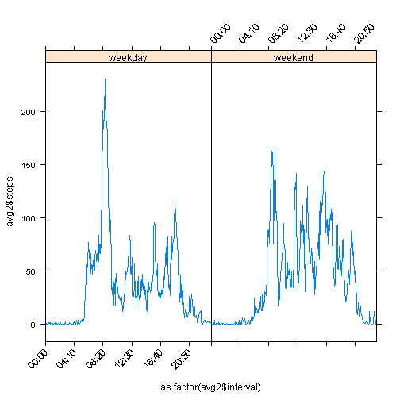

For loading the data located in the working directory use the following code:

```r
library(dplyr)
```

```
## 
## Attaching package: 'dplyr'
## 
## The following object is masked from 'package:stats':
## 
##     filter
## 
## The following objects are masked from 'package:base':
## 
##     intersect, setdiff, setequal, union
```

```r
library(lattice)
library(ggplot2)
```

```
## Warning: package 'ggplot2' was built under R version 3.1.3
```

```r
data<-read.csv("activity.csv")
```

###What is mean total number of steps taken per day?


```r
totals<-aggregate(steps ~ date, data, FUN=sum, na.rm=T)
hist(totals$steps)
```

 

```r
MEAN<-mean(totals$steps)
MEDIAN<-median(totals$steps)
```

The mean of steps taken per day is 1.0766189 &times; 10<sup>4</sup> and the median is 10765.

###Time series plot of the 5-minute interval (x-axis) and the average number of steps taken, averaged across all days (y-axis).


```r
avg<-aggregate(steps ~ interval, data, FUN=mean, na.rm=T)
avg$interval<-formatC(avg$interval, width=4, flag="0")
d<-avg$interval
avg$interval<-paste(substr(d,1,2),substr(d,3,4), sep=":")
avg<-mutate(avg, name=rep("a", 288))
qplot(avg$interval, avg$steps, geom="line") + geom_line(aes(group=avg$name))
```

```
## geom_path: Each group consist of only one observation. Do you need to adjust the group aesthetic?
```

 

```r
max<-which.max(avg$steps)

num<-avg$steps[104]
```

The 104th interval cointains the maximum step average with 206.1698113.

###Part 3 working with NA´s

Total number of NA´s

```r
totalnas<-length(which(is.na(data$steps)))
```

Number of NA´s in observations: 2304.

Filling all missing Values:


```r
for(i in 1:288){
        for(j in 0:60){
                if(is.na(data$steps[i+288*j])){
                data$steps[i+288*j]<-avg$steps[i]
                 }
        
        }
}

totals2<-aggregate(steps ~ date, data, FUN=sum)
hist(totals2$steps)
```

 

```r
nmean<-mean(totals2$steps)

nmedian<-median(totals2$steps)
```

The new mean is 1.0766189 &times; 10<sup>4</sup> and the new median is 1.0766189 &times; 10<sup>4</sup>. We can observe that the mean stays the same and the median is now equal to the mean.

###Dividing by Weekday/Weekend


```r
data$interval<-formatC(data$interval, width=4, flag="0")
d<-data$interval
data$interval<-paste(substr(d,1,2),substr(d,3,4), sep=":")
data<-mutate(data, name=rep("a", 17568))

Sys.setlocale("LC_TIME", "English")
```

```
## [1] "English_United States.1252"
```

```r
data$date<-as.Date(data$date, "%Y-%m-%d")
data<-mutate(data, day=weekdays(data$date))
data<-mutate(data, type=weekdays(data$date))
data$type<-ifelse(data$type == "Saturday", "weekend", ifelse(data$type == "Sunday", "weekend", "weekday"))

avg2<-aggregate(steps ~ interval*type, data, FUN=mean)

okLabs<-seq(1, 288, by=50)
scalesList <- list(x = list(rot = 45, cex = 1.0, 
labels = avg2$interval[okLabs], at = okLabs))
xyplot(avg2$steps~as.factor(avg2$interval) | avg2$type, type="l", scales=scalesList)
```

 

